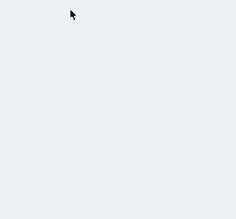

[](https://github.com/ArtBIT/mouse-follower) [](https://github.com/ArtBIT/mouse-follower) [](https://github.com/ArtBIT/mouse-follower/issues)

# Mouse Follower

This is a small experiment that creates a little avatar that follows mouse cursor on the page.

Try the live demo [here](https://artbit.github.io/mouse-follower/demos/).

[](http://github.com/artbit/mouse-follower/)

## Usage
```js
    var follower = new MouseFollower();
    follower.show();
```
To customize the follower you can use the following options:
```js
    var follower = new MouseFollower({
        backgroundImage:'/demos/assets/ghost_body_tartan.gif',
        followStrategy: 'basic', /* basic|wobble */
        width: 50,
        height: 50,
        offsetX: 25,
        offsetY: 25,
        opacity: 0.8,
        spring: 8,          /* springiness coeficient    */
        inertia: 30,        /* how agile the follower is */
        wobble: 50,         /* radius in pixels to wobble around the cursor */
        xflip: false,       /* should the sprite flip horizontally */
        yflip: false,       /* should the sprite flip vertically */
        eyes: {
            backgroundImage:'/demos/assets/ghost_eyes.gif',
            width:12,
            height:16,
            radius: 5,
            offsetX:19,
            offsetY:16,
            opacity: 1
        }
        /* eyes: false - to disable */
    });
    follower.show();
});
```

## Local Build
```
git clone https://github.com/ArtBIT/mouse-follower.git
cd mouse-follower
npm install
npm start
```

## License
MIT
